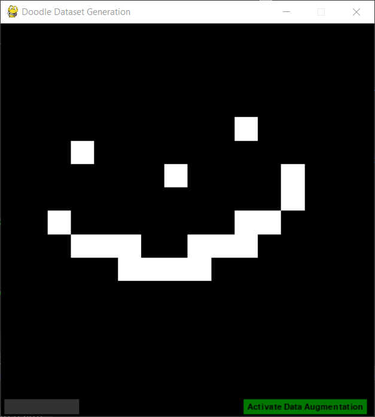
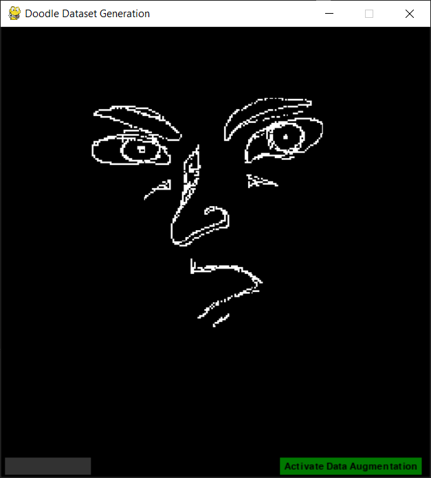
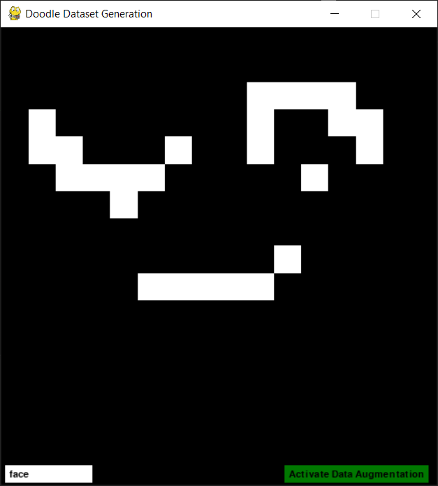
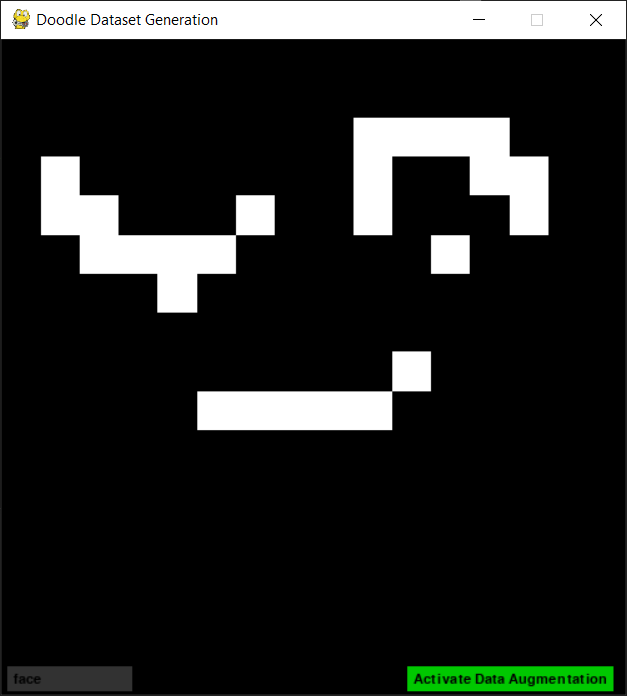
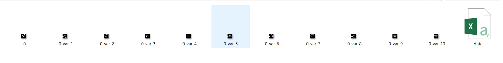

# Doodle Dataset Generation Software

A versatile tool designed for creating custom doodle datasets to aid machine learning and computer vision projects. Written in Python, it uses the Pygame library for the graphic interface and Keras' ImageDataGenerator to perform the optional data augmentation. This software allows users to draw doodles, label them, and save them to disk. It also employs ImageDataGenerator to create variations, making it easy to generate datasets for your projects.

## Table of Contents

- [Doodle Dataset Generation Software](#doodle-dataset-generation-software)
  - [Table of Contents](#table-of-contents)
  - [Installation on windows 10](#installation-on-windows-10)
    - [*Python* installation](#python-installation)
    - [*Git* installation](#git-installation)
    - [Installing the repository](#installing-the-repository)
  - [Usage](#usage)
  - [Configuration](#configuration)
  - [Configuration](#configuration-1)
  - [Contributing](#contributing)
  - [License](#license)
  - [Author](#author)

## Installation on windows 10

### *Python* installation
1. Download a compatible [Python](https://www.python.org/downloads/windows/) version (3.8.10 was used for this project)
2. Make sure to **add python to path**
3. Open a terminal and run `python --version` to confirm the successful installation.

### *Git* installation
1.  Download [the latest version](https://git-scm.com/download/win) of Git and choose the 64/32 bit version.

### Installing the repository
Run the following commands on a configured terminal:
1. `git clone https://github.com/amine-maazizi/Doodle-dataset-generation-software.git`
2. `cd Doodle-dataset-generation-software`
3. `python -m venv env`
4. `env\Scripts\activate`
5. `python -m pip install --upgrade pip`
6. `python -m pip install -r requirements.txt`
7. `python source\main.py`

## Usage

1. Launch the `main.py` file, and you'll access an interface where you can draw your doodles. Use left-click to draw, right-click to erase a pixel, and backspace to clear the entire doodle. 
2. The doodle's resolution can vary based on a specific parameter in the config.json file (explained in the next section).  
3. After drawing, go to the text entry field at the bottom right and specify the class to which the doodle belongs. If no class is entered before submission, it defaults to '0'. 
4. Simplify dataset creation by activating the checkbutton at the bottom left to enable data augmentation. This generates additional images with minor variations.  
5. When ready to submit, press 'Enter' to add the image (or a bundle of images with data augmentation) to the dataset folder.
6. Repeat the process until you have a substantial dataset for your needs.
7. Upon program exit, you'll find a `data.csv` file in the dataset folder, in addition to your drawn doodles. 
8. The `data.csv` file contains the filenames of each doodle and their associated class.
9. Congratulations! You now have a complete dataset ready for your deep learning endeavors.

## Configuration

## Configuration

In the `config.json` file, you can customize various parameters for the Doodle Dataset Generation application:

- **Title**: The title displayed in the application window, which helps you identify the purpose of the tool.

- **ScreenDim**: The dimensions of the application window in the format [width, height]. Adjust this to fit your screen size.

- **GUIPadding**: The amount of padding added to the GUI (Graphical User Interface) at the bottom of the application window.

- **ImageSize**: The size of the doodle canvas in pixels, specified as [width, height]. You can modify this to control the resolution of your doodles.

- **FPS**: Frames Per Second, which determines how smoothly the application runs. Adjust this value based on your system's performance.

- **DatasetDir**: The directory where the dataset is stored. You can change this path according to your preferred folder location.

- **NumberOfVersion**: The number of augmented versions generated for each doodle. You can specify how many variations are created.

- **RotationRange**: The range of rotation (in degrees) for data augmentation.

- **WildthShiftRange**: The range of width shift during data augmentation. Note that there might be a typo in the variable name; it should be "WidthShiftRange."

- **HeightShiftRange**: The range of height shift during data augmentation.

- **ShearRange**: The range of shear transformation during data augmentation.

- **ZoomRange**: The range of zoom applied to the doodles during data augmentation.

- **HorizontalFlip**: A boolean (true/false) value indicating whether to apply horizontal flip as part of data augmentation.

- **FillMode**: The method used to fill in empty areas during data augmentation. You can choose between different modes like "nearest."

Customize these settings in the `config.json` file to tailor the application to your specific requirements and hardware capabilities.

## Contributing

I welcome and appreciate contributions to the Doodle Dataset Generation project. Your contributions help improve the tool and make it more versatile for the community. Here's how you can contribute:

1. **Reporting Issues**: If you encounter any bugs, issues, or unexpected behavior while using the tool, please report them.

2. **Suggesting Features**: If you have ideas for new features or improvements to the tool, you can suggest them.

3. **Pull Requests**: If you'd like to contribute code or fix issues yourself, you can submit pull requests on GitHub. Please make sure to follow these guidelines:
    - Fork the repository to your GitHub account.
    - Create a new branch for your changes.
    - Commit your changes and provide a clear and concise description.
    - Push your branch to your fork.
    - Create a pull request to the original repository.

I appreciate your involvement in making the Doodle Dataset Generation tool better. Your contributions help us enhance its functionality and usability.

## License

This project is licensed under the [MIT License](https://opensource.org/licenses/MIT). You are free to use, modify, and distribute this software as long as you include the original license in your distribution.

## Author

This project is created and maintained by MAAZIZI Amine. You can reach out to me through the following contact information:

- Email: Aminema1000@gmail.com
- GitHub: [GitHub Profile](https://github.com/amine-maazizi)
- LinkedIn: [LinkedIn Profile](https://www.linkedin.com/in/amine-maazizi-190266235/)

Feel free to contact me if you have any questions, suggestions, or feedback related to the project.

